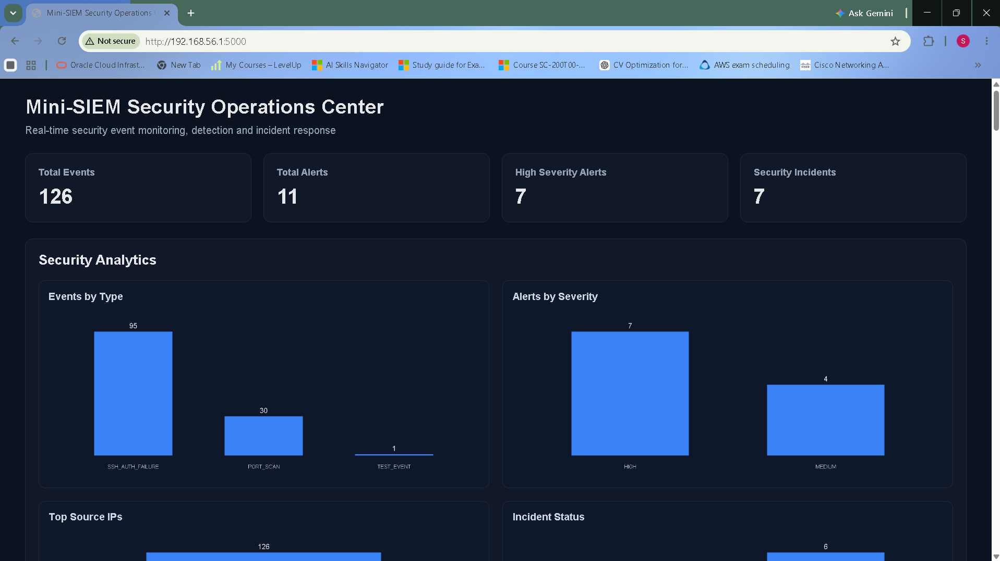
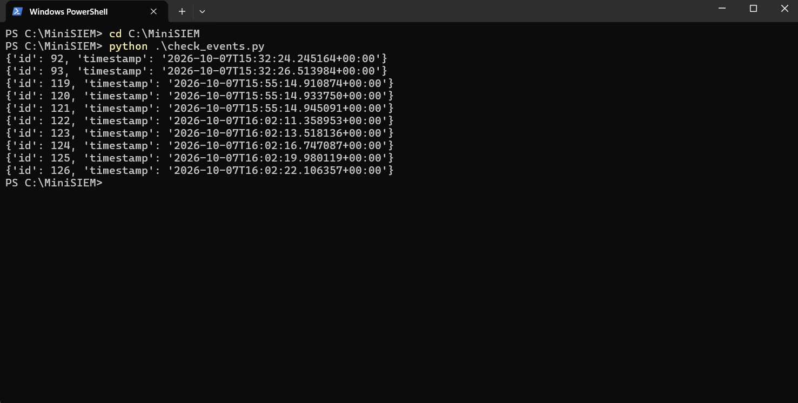
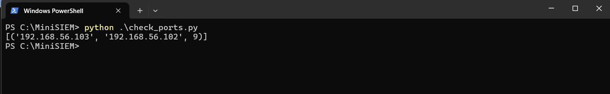

# MiniSIEM - Security Information and Event Management Platform

MiniSIEM is a lightweight, locally hosted Security Information and Event Management (SIEM) platform developed as a cybersecurity project.

The platform collects security-related events, stores them in a SQLite database, applies detection logic to identify suspicious activity, generates alerts with severity levels, and presents the results through a web-based dashboard.

The project was developed and tested in a controlled local lab environment using Python, Flask, SQLite, and a web-based dashboard.

---

## Project Overview

Traditional SIEM platforms can be complex and resource-intensive for beginners.

MiniSIEM was developed as a simplified SIEM platform to demonstrate the fundamental workflow of security monitoring:

**Event Collection -> Storage -> Detection -> Alert Generation -> Incident Identification -> Dashboard Visualization**

The project focuses on understanding how security events can be collected, processed, detected, stored, and presented to a security analyst.

---

## Key Features

* Security event collection
* SQLite-based event storage
* Automated detection logic
* Alert generation
* Severity classification
* Security incident identification
* Port-scan detection
* Web-based monitoring dashboard
* Event and alert statistics
* Flask backend
* Python-based detection engine
* Lightweight local architecture
* Security monitoring in a controlled lab environment

---

## Technology Stack

| Component            | Technology                         |
| -------------------- | ---------------------------------- |
| Programming Language | Python                             |
| Backend Framework    | Flask                              |
| Database             | SQLite                             |
| Frontend             | HTML, CSS, JavaScript              |
| Communication        | HTTP / JSON                        |
| Detection            | Python-based detection engine      |
| Environment          | Windows                            |
| Security Lab         | Kali Linux / Local Virtual Network |

---

## Architecture

```text
                    Security Events
                          |
                          v
                 +------------------+
                 |   Event Input    |
                 +--------+---------+
                          |
                          v
                 +------------------+
                 |  Flask Backend   |
                 |     app.py       |
                 +--------+---------+
                          |
                +---------+---------+
                |                   |
                v                   v
        +---------------+   +---------------+
        |    SQLite     |   |   Detection   |
        |    siem.db   |   |    Engine     |
        +---------------+   | detection.py  |
                            +-------+-------+
                                    |
                                    v
                            +---------------+
                            | Alerts and    |
                            | Incidents     |
                            +-------+-------+
                                    |
                                    v
                            +---------------+
                            | Web Dashboard |
                            | dashboard.html|
                            +---------------+
```

---

## Project Structure

```text
MiniSIEM/
|
|-- app.py
|-- database.py
|-- detection.py
|-- check_events.py
|-- check_ports.py
|-- debug_port_scan.py
|-- siem.db
|-- README.md
|
|-- screenshots/
|   |-- dashboard.png
|   |-- event_records.png
|   |-- port_detection.png
|
|-- templates/
|   |-- dashboard.html
|
`-- venv/
```

---

## File Description

### `app.py`

The main Flask application.

It:

* Starts the web server
* Serves the dashboard
* Handles application routes
* Receives and processes event-related requests
* Connects the different MiniSIEM components

### `database.py`

Handles SQLite database operations.

It is responsible for storing and retrieving MiniSIEM data.

### `detection.py`

Contains the detection logic used to analyze security-related activity and identify suspicious behavior.

The detection layer contributes to alert and security-incident generation.

### `templates/dashboard.html`

The main web interface of MiniSIEM.

It displays monitoring information such as:

* Total events
* Alerts
* High-severity alerts
* Security incidents
* Security activity

### `check_events.py`

A utility script used to verify stored events in the SQLite database.

### `check_ports.py`

A utility script used to verify port-scan-related detection data.

### `debug_port_scan.py`

A debugging and testing utility used during development of the port-scan detection functionality.

### `siem.db`

The SQLite database containing MiniSIEM data.

---

# Detection and Monitoring

MiniSIEM uses Python-based detection logic to analyze incoming security-related activity.

The detection engine can identify suspicious patterns and generate alerts.

One of the demonstrated detection scenarios is **port-scan activity**.

During testing, activity was observed between the following lab systems:

```text
Source Host:      192.168.56.103
Destination Host: 192.168.56.102
```

The port detection test returned:

```text
[('192.168.56.103', '192.168.56.102', 9)]
```

This demonstrates that the MiniSIEM can identify repeated connection activity associated with scanning behavior.

---

# Alert and Incident Monitoring

The dashboard provides a centralized view of security activity.

During testing, the MiniSIEM dashboard displayed:

```text
Total Events:          126
Alerts:                 11
High Severity Alerts:   7
Security Incidents:     7
```

The database was also independently verified using the event-checking utility, with stored event records reaching ID `126`.

This demonstrates that the dashboard statistics are backed by stored application data.

---

# Database

MiniSIEM uses SQLite because it provides a lightweight database suitable for a local cybersecurity project.

The database stores application and security-event information used by the backend and dashboard.

Database file:

```text
siem.db
```

SQLite was selected because it:

* Requires no separate database server
* Is lightweight
* Is easy to deploy locally
* Works well with Python
* Is suitable for a small security monitoring project

---

# Installation

## 1. Clone or download the project

Place the project in a directory such as:

```text
C:\MiniSIEM
```

## 2. Create a virtual environment

```powershell
python -m venv venv
```

## 3. Activate the virtual environment

```powershell
.\venv\Scripts\Activate.ps1
```

## 4. Install dependencies

If a `requirements.txt` file is provided:

```powershell
pip install -r requirements.txt
```

Otherwise, install Flask:

```powershell
pip install flask
```

---

# Running MiniSIEM

Open PowerShell and navigate to the project directory:

```powershell
cd C:\MiniSIEM
```

Activate the virtual environment:

```powershell
.\venv\Scripts\Activate.ps1
```

Start the application:

```powershell
python .\app.py
```

Open the dashboard in a browser:

```text
http://127.0.0.1:5000
```

---

# Testing

## Check Stored Events

Run:

```powershell
python .\check_events.py
```

This verifies that events are being stored in the SQLite database.

Example output includes stored event IDs and timestamps:

```text
{'id': 92, 'timestamp': '2026-10-07T15:32:24.245164+00:00'}
{'id': 93, 'timestamp': '2026-10-07T15:32:26.513984+00:00'}
...
{'id': 126, 'timestamp': '2026-10-07T16:02:22.106357+00:00'}
```

## Check Port Detection

Run:

```powershell
python .\check_ports.py
```

Example output:

```text
[('192.168.56.103', '192.168.56.102', 9)]
```

This verifies port-scan-related detection data.

---

# Dashboard

The MiniSIEM dashboard provides a centralized view of collected security information.

It allows an analyst to quickly understand:

* How many events have been collected
* How many alerts have been generated
* How many alerts are high severity
* How many security incidents have been identified
* Current security activity detected by the system

## Dashboard Overview



During testing, the dashboard displayed:

* **126 Total Events**
* **11 Alerts**
* **7 High Severity Alerts**
* **7 Security Incidents**

---

## Event Records

The stored event records were verified using the `check_events.py` utility.



The test confirmed that event records were stored in the SQLite database, with event IDs reaching `126`.

---

## Port-Scan Detection

Port-scan-related detection data was verified using `check_ports.py`.



The test produced:

```text
[('192.168.56.103', '192.168.56.102', 9)]
```

---

# Security Testing Environment

Testing was performed in a controlled local environment.

Example lab addresses:

```text
Kali / Source Host:
192.168.56.103

Monitored Host:
192.168.56.102
```

The environment used a private virtual network for testing.

All security testing was performed for educational and authorized laboratory purposes.

---

# Learning Objectives

This project was developed to gain practical understanding of:

* SIEM architecture
* Security event collection
* Event and log storage
* Detection engineering
* Alert generation
* Severity classification
* Incident monitoring
* Flask web applications
* SQLite databases
* Python backend development
* Frontend/backend communication
* Security monitoring workflows
* Basic security-event analysis

---

# Future Improvements

Possible future improvements include:

* Automatic data retention and cleanup
* More detection rules
* Authentication and role-based access
* Real-time event streaming
* Advanced filtering and search
* IP reputation checking
* Geo-IP enrichment
* Email or messaging notifications
* More detailed incident investigation
* Log ingestion from additional sources
* Integration with external security tools
* Improved dashboard visualizations
* Production-grade database support

---

# Disclaimer

MiniSIEM is an educational cybersecurity project designed for authorized testing and learning.

Security testing should only be performed against systems and networks for which you have explicit permission.

---

# Author

Developed as a cybersecurity and security-monitoring project to explore the fundamentals of SIEM architecture, detection engineering, event monitoring, and security operations.
